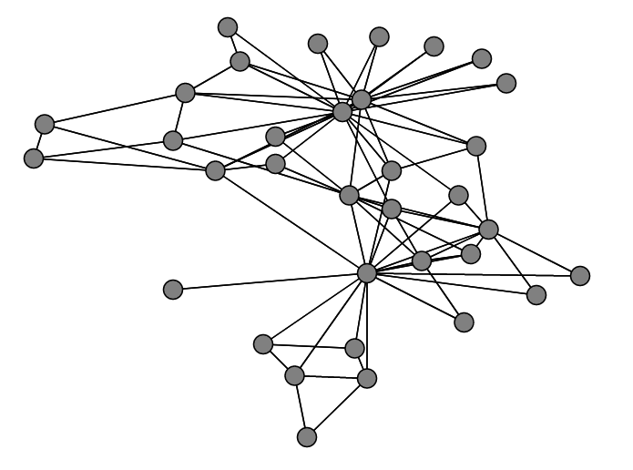

# Introduction

The purpose of this repository is to help anyone who wishes to find the communities present in a given graph. This resource should streamline the implementation process as well as provide basic information about each graph clustering method. Since not all coding environments have implementations of each method, this repository will also provide packages and pre-written code for Python, R, and MATLAB when available.

# Defining the Problem

Let $G = (V, E)$ be a graph, where *V* is the set of vertices or nodes, and $E$ is the set of connections or edges such that $E \subset V \times V$. A visualization of a graph can be seen below:

Usually, this data will be given in what is known as an adjacency matrix. The adjacency matrix $A$ is an $n \times n$ matrix, where $n$ represents the number of nodes in the graph. Element $A$ij equals 1 if an edge exists between nodes $i$ and $j$, and 0 otherwise. For large graphs, using a sparse matrix will speed up the run time.

# Clustering Algorithms

This repository contains code or direction to packages that run various different graph clustering algorithms, including:

* Label Propogation
* Kmeans
* Ncut
* Louvain
* Nonnegative Matrix Factorization Using Graph Random Walk (NMFR)

## Label Propogation

## Kmeans

## Ncut

## Louvain

## NMFR
