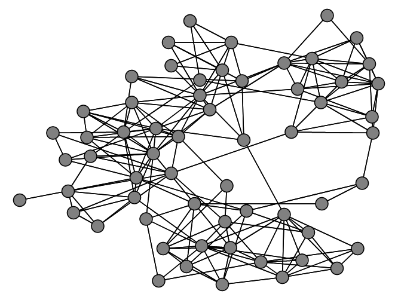

# Introduction

The purpose of this repository is to help anyone who wishes to find the hidden groups in a given graph. This resource should streamline the implementation process as well as provide basic information about each graph clustering method. Since not all coding environments have implementations of each method, this repository will also provide packages and pre-written code for Python, R, and MATLAB when available.

# Defining the Problem

We define a graph $G$ as $G = (V, E)$, where *V* is the set of vertices or nodes, and $E$ is the set of connections or edges such that $E  \subset V \times V$.

# Clustering Algorithms
